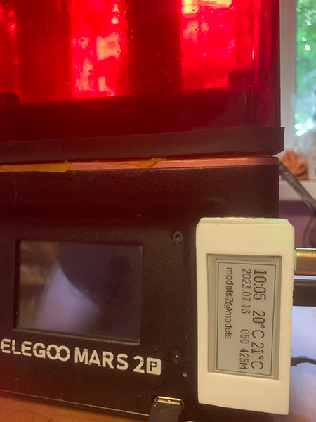

Just completed Pi Zero W file server for my Mars 2 Pro. Don’t have time to write complete guide, but here is the links to the items and software I used:

Pi Zero W as usb flash
https://www.reddit.com/r/ElegooMars/comments/jxhyi3/using_a_pi_zero_w_as_a_smart_usb_flash_drive_for/

It has ePaper display

Display
https://www.adafruit.com/product/3335

Display software
https://github.com/PiSupply/PaPiRus

And case

Case
https://github.com/fredg02/papirus_zero_case

And also queries temperature sensor inside the case via bluetooth

Bluetooth sensor library:
https://github.com/JsBergbau/MiTemperature2

Bluetooth sensor
https://www.aliexpress.com/w/wholesale-xiaomi-mijia-bluetooth-temperature-smart-humidity-sensor.html

I wrote two services for display and buttons (1 - reboot, 2 - shutdown)
and temperature reading code (it uses tmpfs to store readings because I use them also for displaying this data on my computer and to save power of sensor on queries I do this only once and store value in temporary file for all scripts to use)

add to fstab for in memory temporary partition:
tmpfs /temptemp tmpfs defaults,noatime,size=1m 0 0
 
crontab for reading temperature:
*/8 * * * * /home/pi/readtemp.sh > /temptemp/readings0.txt ; cp /temptemp/readings0.txt /temptemp/readings.txt 

System connects to the 5V adapter via micro-usb power connector and to the printer via modified usb cable - to avoid powering printer control board through the usb connector it is necessary to cut +5V wire (usually it is red) leaving only two data and ground (white,green and black) wires
